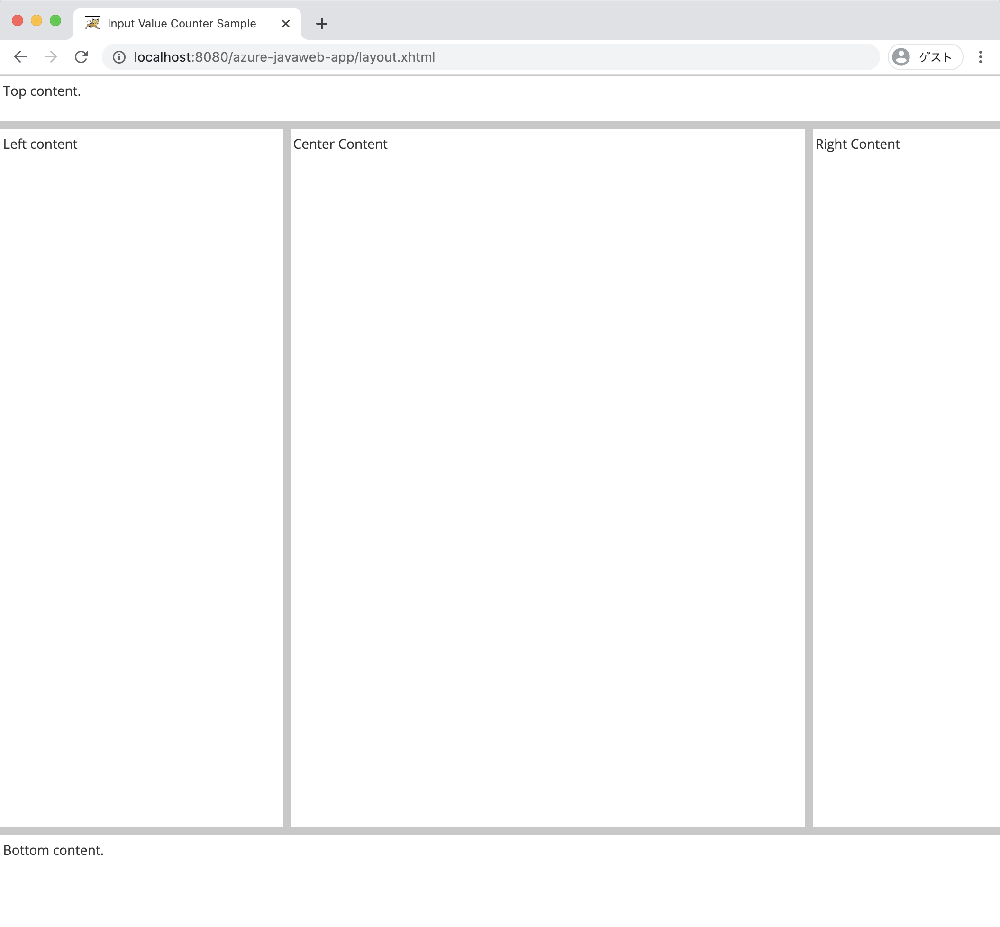
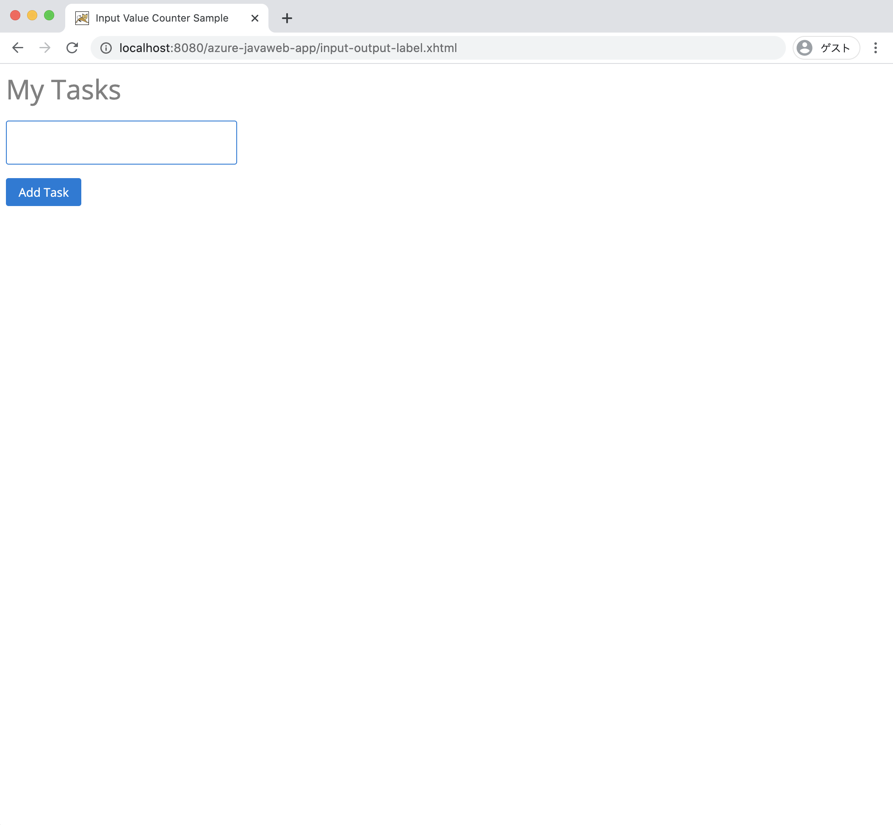
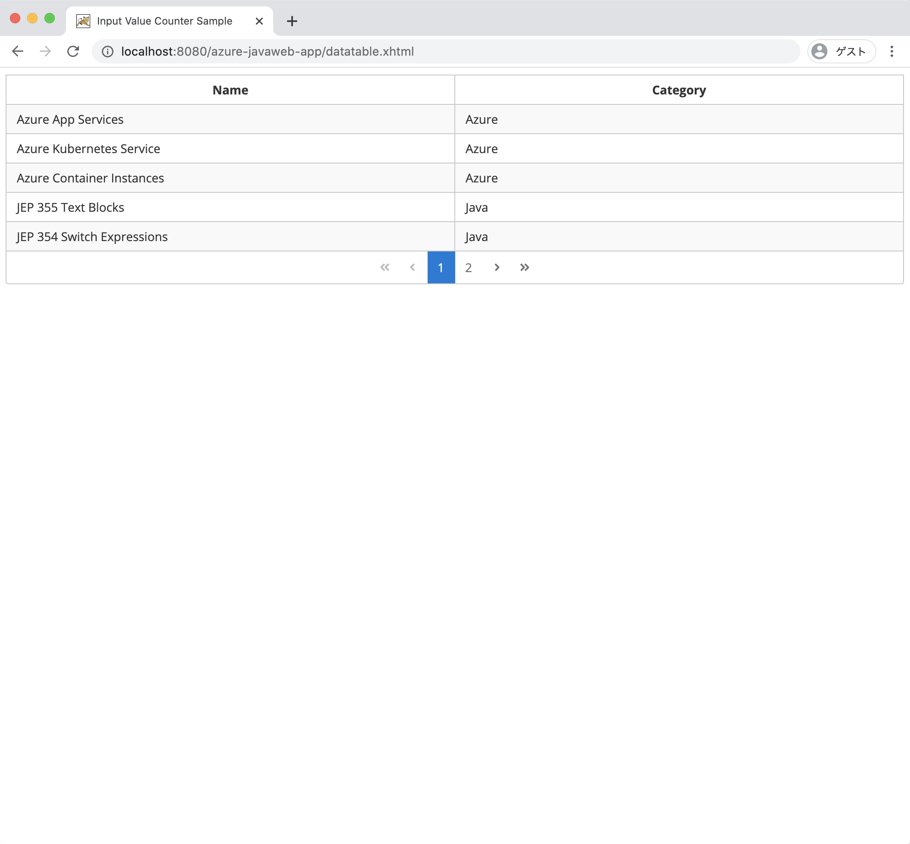

# Deploy PrimeFaces JSF Web Application to Tomcat 9.0.x


## Overview of this Application

This Java Web Application is not a Microservices but standard Java Web Application which is wrote by using Java EE 8 technologies.  
In this module, we'll create a `Todo` application and learn about its PrimeFaces components. The `Todo` application can add new tasks, see the lists of all tasks, and mark the task as finished.
In this exercise, you'll build this web application.


 

## PrimeFaces Component in the Application

Let's look at the PrimeFaces components that we 'll use to create your Todo application.

### PrimeFaces Layout

`PrimeFaces Layout` creates a layout for the entire screen. PrimeFaces allows you to configure various layouts. For example, if you want to create headers, footers, menus that you often see in general web pages, you can easily configure the screen layout by using the `p:layout`, `p:layoutUnit` tags like below.
In the Todo Application, we'll use the `position="north"` and `position="center"` tags.

```xml
<p:layout fullPage="true">
    <p:layoutUnit position="north" size="50">
        <h:outputText value="Top content." />
    </p:layoutUnit>
    <p:layoutUnit position="south" size="100">
        <h:outputText value="Bottom content." />
    </p:layoutUnit>
    <p:layoutUnit position="west" size="300">
        <h:outputText value="Left content" />
    </p:layoutUnit>
    <p:layoutUnit position="east" size="200">
        <h:outputText value="Right Content" />
    </p:layoutUnit>
    <p:layoutUnit position="center">
        <h:outputText value="Center Content" />
    </p:layoutUnit>
</p:layout>
```

 


### PrimeFaces OutputLabel, InputText, CommandButton

In the next section we'll discuss the `p:outputLabel`,`p:inputText`, `p:commandButton` tags as show in the below example:

   ```xml
    <h:form>
        <p:outputLabel id="out" value="My Tasks" />
        <p:inputText id="name" value="#{todocontroller.name}" />
        <p:commandButton id="addtask" value="Add Task"  
            action="#{todocontroller.buttonAddAction()}"
            styleClass="ui-priority-primary" />
    </h:form>
   ```

#### p:outputLabel

`p:outputLabel` is a component for displaying text and is an extension of the standard outputLabel of JSF. Since `value ="My Tasks"` and a static character string are described here, `My Tasks` is also displayed on the screen, but if you want to change the character string to be outputted dynamically, you can replace it with the EL expression `#{todocontroller.name}` and binding it to the backing bean field as described in `p:inputText`.

#### p:inputText

`p:inputText` is a component for working with input text fields and extends the standard `inputText` component of JSF.
The EL expression `#{todocontroller.name}` binds the value to the field defined in the corresponding backing bean (TodoListController) class, and the value entered by the user can now be referenced by `name` from other code.

#### p:commandButton

`p:commandButton` is a component for displaying buttons and extends the standard `commandButton` component of JSF. When the button is pressed, the EL expression `#{todocontroller.buttonAddAction()` described in `action` is executed. Specifically, the `buttonAddAction()` method defined in the corresponding backing bean (TodoListController) class is invoked.
You can also execute the process with Ajax by adding `update=" target-id"` to the button's attribute.

#### Backing Beans for JSF pages

An implementation example of the Backing Bean corresponding to the above Facelets(XHTML) is shown below.
The content entered in `p:inputText` can be bound to `name` of instance field in the `TodoListController` class and handled in the program. Also, when a button is pressed with `p:commandButton`, then the `buttonAddAction()` method of the `TodoListController` class is invoked to print the value entered by the user in `name` on the standard output.

   ```java
import lombok.Getter;
import lombok.Setter;
import javax.faces.view.ViewScoped;
import javax.inject.Named;
import java.io.Serializable;

@Named("todocontroller")
@ViewScoped
public class TodoListController implements Serializable {

    @Setter @Getter
    private String name;

    public void buttonAddAction(){
        System.out.println("Input Value is " name);
        // write some command action
    }
}
   ```

After you create the XHTML and Backing Bean, the following screen will be displayed:



### PrimeFaces DataTable

`p:dataTable` is a component for displaying HTML tables, which is an extension of a standard JSF table. You can use the Paginator function by adding the `paginator` attribute. Here, the transition function of Paginator is placed at the bottom of the table and is set with `paginatorPosition="bottom"` attribute, and five items that can be displayed on the screen by default because we configured it with `rows="5"`.  

The display items in the table use `todoItems`, which is defined in the `TodoListController` class. You can refer each element in the List by using `var="item"`. For example, `#{item.name}` and `#{item.category}` are used to display each value of the `TodoItem` instance in the List.

```xml
    <h:form>
        <p:dataTable id="itemTables" var="item" 
            value="#{todocontroller.todoItems}" paginator="true"
            paginatorPosition="bottom" rows="5">

            <p:column headerText="Name">
                <h:outputText value="#{item.name}" />
            </p:column>
            <p:column headerText="Category">
                <h:outputText value="#{item.category}" />
            </p:column>

        </p:dataTable>
    </h:form>
```

The implementation example of the `TodoListController` class is described below.
In this example, the `@PostConstruct init()` method is used to generate dummy `List <TodoItem>` data when this instance is created.
In our code, dummy data is generated at startup, so it displays some contents by default.

```java
import com.microsoft.samples.model.TodoItem;
import lombok.Getter;
import lombok.Setter;
import javax.annotation.PostConstruct;
import javax.faces.view.ViewScoped;
import javax.inject.Named;
import java.io.Serializable;
import java.util.ArrayList;
import java.util.List;

@Named("todocontroller")
@ViewScoped
public class TodoListController implements Serializable {

    private static final long serialVersionUID = 8118071083254011575L;

    @Setter @Getter
    private List<TodoItem> todoItems;

    @PostConstruct
    public void init(){
        TodoItem item1 = new TodoItem("App Services","Azure",false);
        TodoItem item2 = new TodoItem("Azure Kubernetes Service","Azure",false);
        TodoItem item3 = new TodoItem("JEP 359","Java",false);
        TodoItem item4 = new TodoItem("JEP 368","Java",false);
        TodoItem item5 = new TodoItem("MicroProfile","Java",false);
        TodoItem item6 = new TodoItem("Spring Boot","Java",false);
        TodoItem item7 = new TodoItem("Jakarta EE","Java",false);

        todoItems = new ArrayList<>();
        todoItems.add(item1);
        todoItems.add(item2);
        todoItems.add(item3);
        todoItems.add(item4);
        todoItems.add(item5);
        todoItems.add(item6);
        todoItems.add(item7);
    }
}
```

The implementation of the `TodoItem` class is described below.
We'll use this class to manage the display of data.
We use the `@Data` annotation of `Project Lombok`, so our Setter/Getter method is automatically added for all fields and `toString()`, `equals (Object o)`, and `hashCode()` methods will be overridden by default.

```java
import java.io.Serializable;
import lombok.Data;

@Data
public class TodoItem implements Serializable {

    private static final long serialVersionUID = -8967340396649549045L;
    private Long id;
    private String category;
    private String name;
    private boolean complete;

    public TodoItem() {}

    public TodoItem(String name, String category, boolean complete) {
        this.name = name;
        this.category = category;
        this.complete = complete;
    }

    public TodoItem( String name, String category) {
        this.category = category;
        this.name = name;
        this.complete = false;
    }

    @Override
    public String toString() {
        return String.format(
                "TodoItem[id=%d, category='%s', name='%s', complete='%b']",
                id, category, name, complete);
    }
}
```

After you execute the above DataTable, the following screen will be displayed:



## Exercise Create Todo web app with PrimeFaces

In the above, we discussed how to use PrimeFaces Components.  
Now, we'll create your `Todo` Application by using the above PrimeFaces components.


At First we'll create the PrimeFaces Web Page in an XHTML file. After that, we'll create the `DataModel` class. In the DataModel class, we'll define `id`, `category`, `name`, and `complete` fields. All our Todo items will have these attributes. Then we'll create a `DAO` class, which is used to store the data of Todo Items and update Items. Finally we'll create the `Controller` class, which is used as a Backing Bean for our PrimeFaces Web Page. In this class, we'll implement the binding field of the PrimeFaces web page and also implement the operation when a user pushes its button.

### Creating a JSF Web Page

This view uses the components of `p:layout`,`p:layoutUnit`, `p:outputLabel`,`p:inputText`, `p:commandButton`, and `p:dataTable` explained in the previous section.

This page supports `Ajax`, so when the button `Add Task` is pressed, we'll dynamically add the task to our `p:dataTable` field (This dynamic binding is because we bind the action of `update="itemTables"` to `p:commandButton`)

We also add a new attribute to the DataTable, `selection ="#{todocontroller.selectedItems}"`. You can now select items in your table using checkboxes, and complete a task by selecting the checkbox and pressing the `Update Task` button.

Copy and paste the code below into the index.xhtml file to create a view for your Todo application:

   ```xml
<!DOCTYPE html>
<html xmlns="http://www.w3.org/1999/xhtml" xmlns:f="http://xmlns.jcp.org/jsf/core"
      xmlns:h="http://xmlns.jcp.org/jsf/html" xmlns:ui="http://xmlns.jcp.org/jsf/facelets"
      xmlns:p="http://primefaces.org/ui">

<h:head>
    <title>TODO App</title>
</h:head>
<h:body>

    <p:layout fullPage="true">
        <p:layoutUnit style="background-color: black; position: relative; height: 100px;" position="north" size="100"
                      resizable="false" closable="false" collapsible="true">
            <div class="header-task" style="margin: 50px; padding: 20px;">
                <p:outputLabel
                        style="color: #808080; font-size: 2em; position: absolute;top: 50%; -webkit-transform : translateY(-50%); transform : translateY(-50%);"
                        value="My Tasks"/>
            </div>
        </p:layoutUnit>

        <p:layoutUnit position="center">
            <h:form id="updateForm">
                <div class="task-lists" style="margin: 50px; padding: 20px;">
                    <p:outputLabel value="My ToDo List" style="font-size: 3em;"/>
                    <p/>

                    <p:dataTable id="itemTables" var="item" value="#{todocontroller.todoItems}"
                                 disabledSelection="#{item.complete == true}"
                                 selection="#{todocontroller.selectedItems}" rowKey="#{item.name}" paginator="true"
                                 paginatorPosition="bottom" rows="20">

                        <p:column headerText="Name">
                            <h:outputText value="#{item.name}"/>
                        </p:column>
                        <p:column headerText="Category">
                            <h:outputText value="#{item.category}"/>
                        </p:column>
                        <p:column headerText="Complete" selectionMode="multiple" style="text-align:center"/>
                    </p:dataTable>

                    <div class="updatataks" style="margin: 15px">
                        <p:commandButton value="Update Task" id="updatatask" update="itemTables"
                                         action="#{todocontroller.buttonUpdateAction()}" style="margin-right:20px;"
                                         styleClass="ui-priority-primary"/>
                    </div>
                </div>

                <hr style="margin: 50px;"/>

                <div class="task-add" style="margin: 50px; padding: 20px;">
                    <h:panelGrid columns="2" cellpadding="5">
                        <p:outputLabel style="font-size: 1.4em;" value="Task Name :"/>
                        <p:inputText style="font-size: 1.4em;" id="name" value="#{todocontroller.name}"/>


                        <p:outputLabel style="font-size: 1.4em;" value="Task Category : "/>
                        <p:inputText style="font-size: 1.4em;" id="category" value="#{todocontroller.category}"/>
                    </h:panelGrid>
                    <p/>
                    <p:commandButton update="itemTables" value="Add Task" id="addtask"
                                     action="#{todocontroller.buttonAddAction()}"
                                     style="margin-right:20px;" styleClass="ui-priority-primary"/>
                </div>
            </h:form>
        </p:layoutUnit>
    </p:layout>
</h:body>
</html>
   ```

### Create DataModel Class

First, we'll implement the data model classes in the `com.microsoft.azure.samples.model` package.
Execute the following command to create a directory for the package:

```bash
mkdir src/main/java/com/microsoft/azure/samples/model
```

Then create a `TodoItem.java` file inside the `com.microsoft.azure.samples.model` package directory and copy and paste the code below:

   ```java
package com.microsoft.azure.samples.model;

import java.io.Serializable;
import lombok.Data;

@Data
public class TodoItem implements Serializable {

    private static final long serialVersionUID = -8967340396649549045L;
    private Long id;
    private String category;
    private String name;
    private boolean complete;

    public TodoItem() {}

    public TodoItem( String name, String category) {
        this.category = category;
        this.name = name;
        this.complete = false;
    }

    public TodoItem(String name, String category, boolean complete) {
        this.name = name;
        this.category = category;
        this.complete = complete;
    }

    @Override
    public String toString() {
        return String.format(
                "TodoItem[id=%d, category='%s', name='%s', complete='%b']",
                id, category, name, complete);
    }
}
   ```

### Create DAO Class

We'll create a class for Data Access in the `com.microsoft.azure.samples.dao` package.
Execute the following command to create a directory for the package:

```bash
mkdir src/main/java/com/microsoft/azure/samples/dao
```

In a production environment, you use a Database, in-memory grids, and document databases to store data. In the next section, we'll use a List to simulate a database.

Our class will be annotated with `@ApplicationScoped`. This annotation allows the data of `todoItems` to be available from the start to the end of our application's lifecycle.

Next, create a `TodoItemManagement.java` file inside the `com.microsoft.azure.samples.dao` package directory and copy and paste the code below.


```java
package com.microsoft.azure.samples.dao;

import com.microsoft.azure.samples.model.TodoItem;
import javax.enterprise.context.ApplicationScoped;
import java.util.List;
import java.util.concurrent.CopyOnWriteArrayList;

@ApplicationScoped
public class TodoItemManagement {

    private CopyOnWriteArrayList<TodoItem> todoItems  = new CopyOnWriteArrayList<TodoItem>();

    public  CopyOnWriteArrayList<TodoItem> getTodoItems() {
        return todoItems;
    }

    public  void setTodoItems(CopyOnWriteArrayList<TodoItem> todoItems) {
        this.todoItems = todoItems;
    }

    public void addTodoItem(TodoItem item) {
        synchronized (this){
            int size = todoItems.size();
            long id = 0;
            if(size != 0){
                id = todoItems.get(size - 1).getId();
                id++;
            }
            item.setId(id);
            todoItems.add(item);
        }
    }

    public void updateTodoItem(List<TodoItem> items){
        items.stream().forEach(item -> {
            item.setComplete(true);
            synchronized (this) {
                todoItems.set(item.getId().intValue(), item);
            }
        });
    }

}
```

### Create Controller Class

Finally, we'll implement the class for the controller in the `com.microsoft.azure.samples.controller` package.
Execute the following command to create a directory for the package:

```bash
mkdir src/main/java/com/microsoft/azure/samples/controller
```

The annotations `@ViewScoped` and `@Named` are added to this class. `@ViewScoped` is useful for creating Single Page Application web pages with a scope that is valid until the screen is reloaded or a screen transition occur. Also, by adding the `@Named` annotation, you can refer to this class from Facelets (XHTML) using EL expressions.

In the implementation, we use `@Inject` to inject an instance of `TodoItemManagement`. And it's used to add the data (`buttonAddAction()`), refer the data(`getTodoItems()`), and update the data (`buttonUpdateAction()`). We'll also be implementing each method in the `TodoItemManagement` class.

We also added the `selectedItem` and `selectedItems` fields to allow each row in the table to be selected, and the `onRowSelect(SelectEvent<TodoItem> event)` and `onRowUnselect(UnselectEvent <TodoItem> event)` methods.
Each method can act on the event when the table is selected or not selected. Even though no processing is done on selection, if this method isn't defined, a compile error will occur.

Next, create a `TodoListController.java` file inside the `com.microsoft.azure.samples.controller` package directory and copy and paste the code below.

```java
package com.microsoft.azure.controller;

import com.microsoft.azure.samples.dao.TodoItemManagement;
import com.microsoft.azure.samples.model.TodoItem;
import org.primefaces.event.SelectEvent;
import org.primefaces.event.UnselectEvent;

import lombok.Getter;
import lombok.Setter;

import javax.annotation.PostConstruct;
import javax.faces.application.FacesMessage;
import javax.faces.context.FacesContext;
import javax.faces.view.ViewScoped;
import javax.inject.Inject;
import javax.inject.Named;
import java.io.Serializable;
import java.util.List;

@Named("todocontroller")
@ViewScoped
public class TodoListController implements Serializable {

    private static final long serialVersionUID = -1945255472338540370L;

    @Inject
    TodoItemManagement todoManagement;

    private List<TodoItem> todoItems;
    @Setter @Getter
    private TodoItem selectedItem;
    @Setter @Getter
    private List<TodoItem> selectedItems;
    @Setter @Getter
    private String name;
    @Setter @Getter
    private String category;


    public List<TodoItem> getTodoItems() {
        return todoManagement.getTodoItems();
    }

    public void buttonUpdateAction(){
        todoManagement.updateTodoItem(selectedItems);
    }

    public void buttonAddAction(){
        TodoItem addItem = new TodoItem(name, category, false);
        todoManagement.addTodoItem(addItem);
    }

    public void onRowSelect(SelectEvent<TodoItem> event) {
        FacesMessage msg = new FacesMessage("TodoItem Selected", event.getObject().getId().toString());
        FacesContext.getCurrentInstance().addMessage(null, msg);
    }

    public void onRowUnselect(UnselectEvent<TodoItem> event) {
        FacesMessage msg = new FacesMessage("Car Unselected", event.getObject().getId().toString());
        FacesContext.getCurrentInstance().addMessage(null, msg);
    }
}
```

### Compile and Package the Java Project

Once you complete the above programs, compile the program and execute the following command:

```bash
mvn clean package
```

### Run in local Tomcat environment

This step is optional if you have installed Tomcat in your local environment. If you don't have the local environment, continue to the Next section.

#### Copy the artifact to the Deployment Directory on Tomcat

```bash
cp target/azure-javaweb-app.war /$INSTALL_DIR/apache-tomcat-9.0.39/webapps/
```

#### Start the Tomcat Server

```bash
$INSTALL_DIR/apache-tomcat-9.0.39/bin/startup.sh
```

After running Tomcat, access `http://localhost:8080/azure-javaweb-app/` and you'll see the screen below.
Use the `Add Task` button to add a task, or use the `Update Task` to update the task.


You have successfully run the Todo web application implemented in PrimeFaces in your local Tomcat environment.
